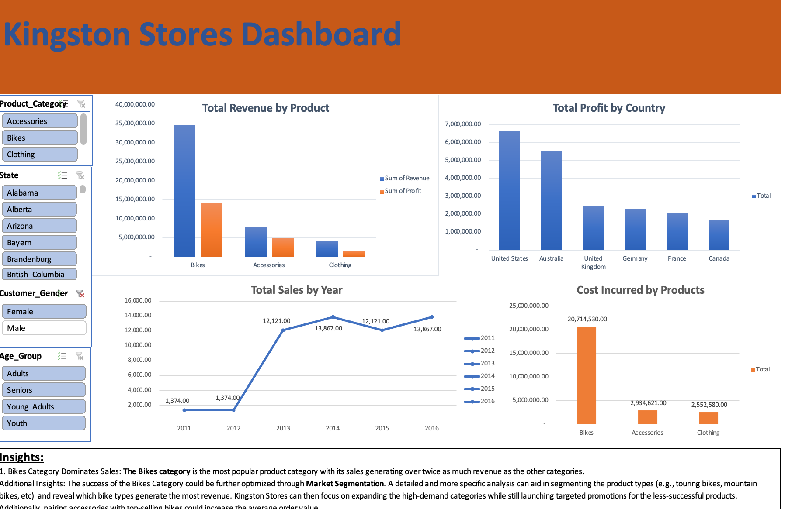

# KingstonSales Dashboard

This is an Excel-based dashboard created to analyze and visualize key sales metrics. The dashboard provides an interactive overview of sales performance, with breakdowns by category, region, and time period.

## Project Overview

This dashboard was designed using Microsoft Excel and includes:
- Pivot tables and charts
- Slicers for filtering
- Conditional formatting
- Clear data visuals to support business decisions

## Goals
- Summarize sales trends
- Identify top-performing products or regions
- Spot opportunities or areas needing attention

## Key Features
- Dynamic filtering by region and category
- Total sales and revenue visualizations
- Insights into sales over time

## Tools Used
- Microsoft Excel (formulas, pivot tables, slicers, charting tools)

## How to Use
1. Download the Excel file.
2. Open in Microsoft Excel (best viewed on desktop).
3. Use slicers to explore the data interactively.
4. Analyze the charts to draw conclusions.

## Note
This was one of my earlier projects while learning how to create dashboards with Excel. It focuses on clarity and basic interactivity over complexity.
